# KRover

Dieses Projekt realisiert ein GNSS-RTK-Rover-System für rund 150 €.

KRover dient zur Anzeige von Flurstücken, zur Navigation zu Grenzpunkten und
zur Aufnahme eigener Punkte, Strecken, Flächen und relativer Höhen. Das System
besteht aus einer nativen iOS-App und einem ESP32-S3-basierten Rover mit
Quectel-LG290P-Empfänger und Neigungssensor.

Die App lädt Karten- und Flurstücksdaten, empfängt SAPOS-Korrekturdaten über
NTRIP und kommuniziert bidirektional per Bluetooth Low Energy (BLE) mit der
Rover-Hardware. RTCM-Korrekturen laufen von der App über BLE und UART zum
LG290P; GNSS-, IMU- und Statusdaten werden in Gegenrichtung an die App
übertragen.

<table>
  <tr>
    <td align="center" valign="top" width="33%">
      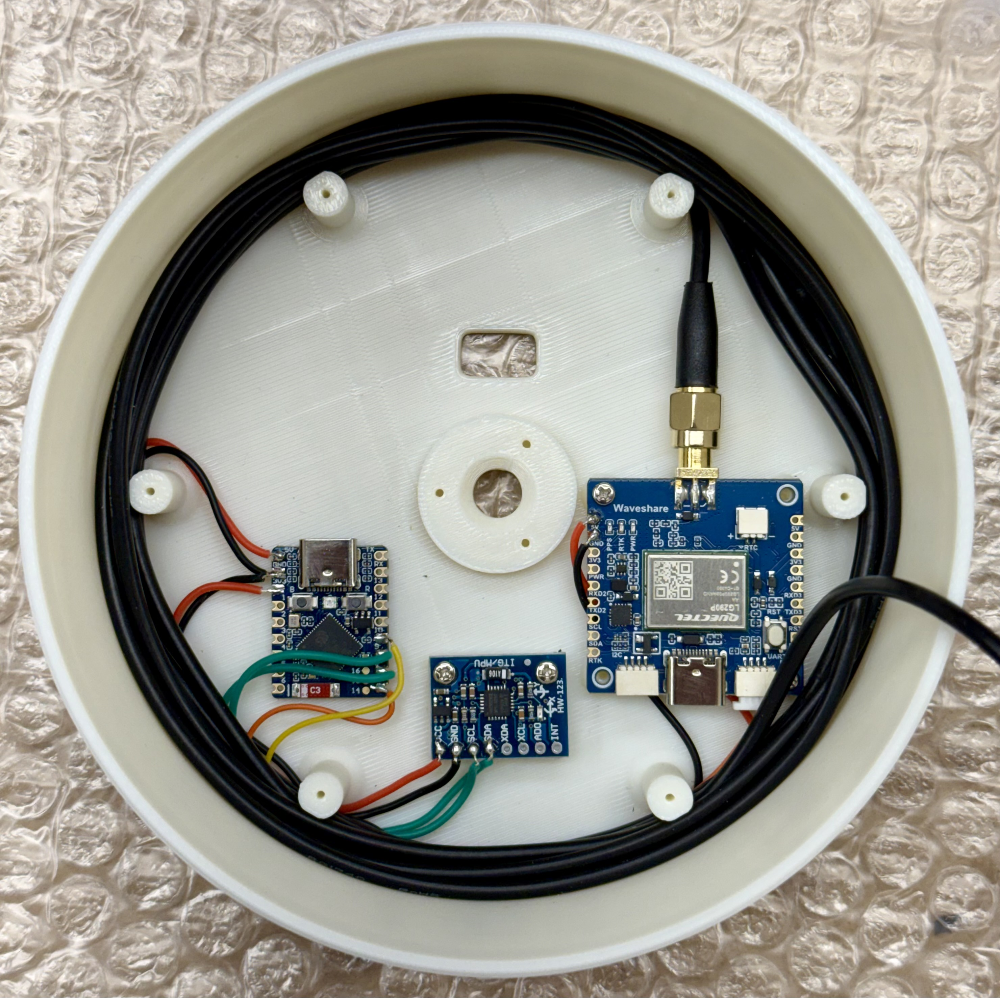
    </td>
    <td align="center" valign="top" width="33%">
      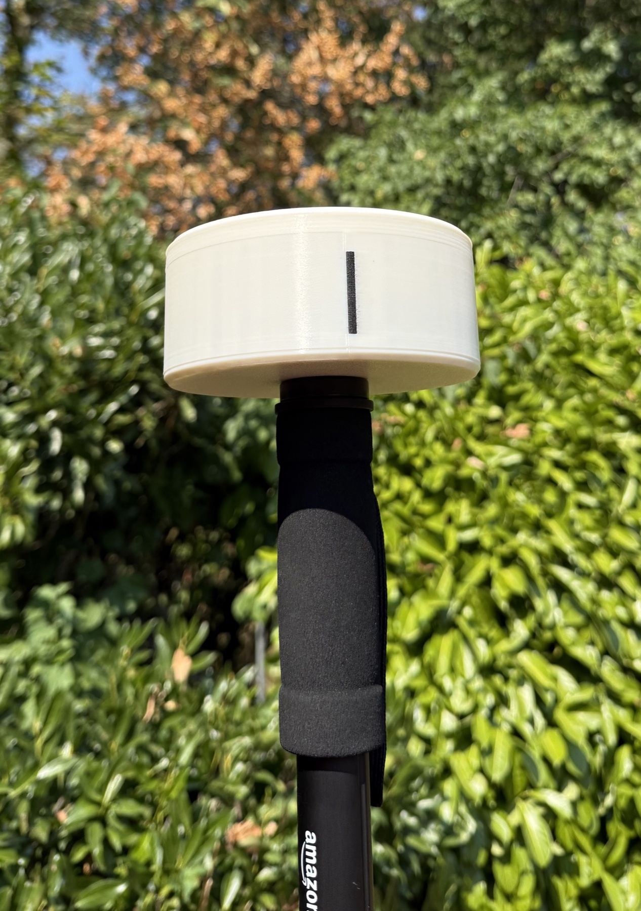
    </td>
    <td align="center" valign="top" width="33%">
      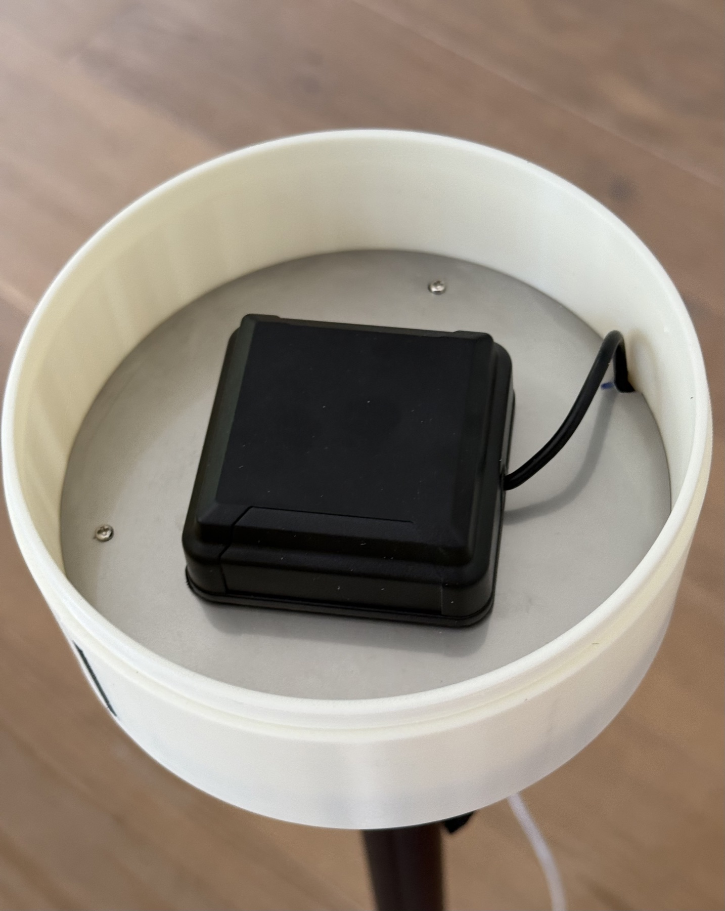
    </td>
  </tr>
</table>

<p align="center">
  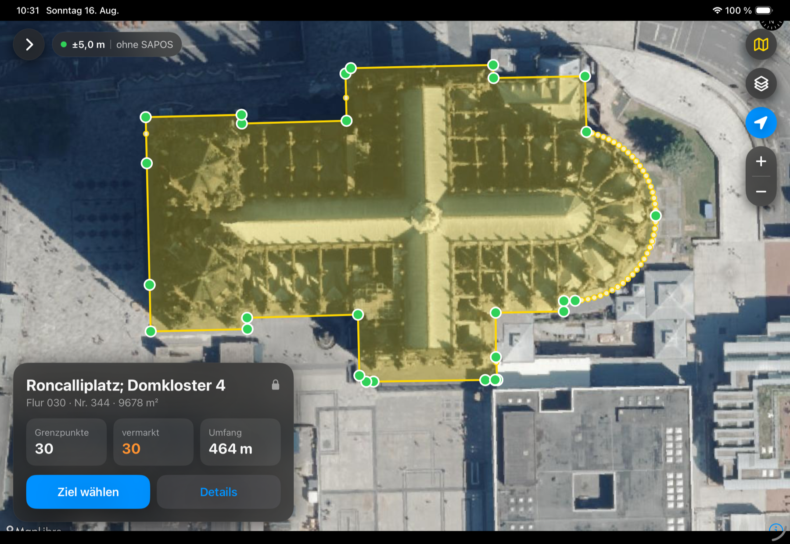
</p>
<p align="center">
  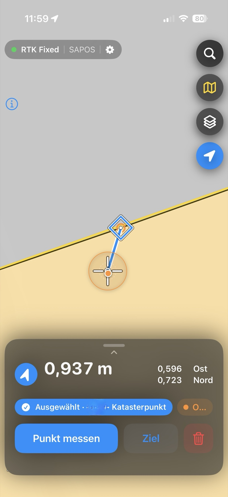
  &nbsp;&nbsp;&nbsp;
  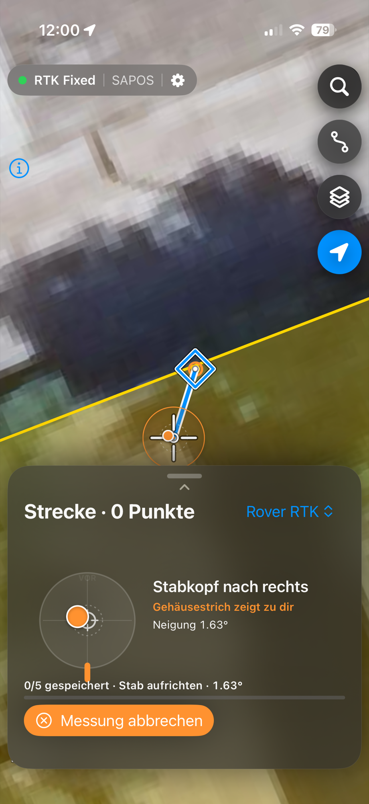
</p>

## Benötigte Hardware

<table>
  <tr>
    <td align="center" width="33%">
      <strong>ESP</strong><br>
      Waveshare ESP32-S3-Zero<br><br>
      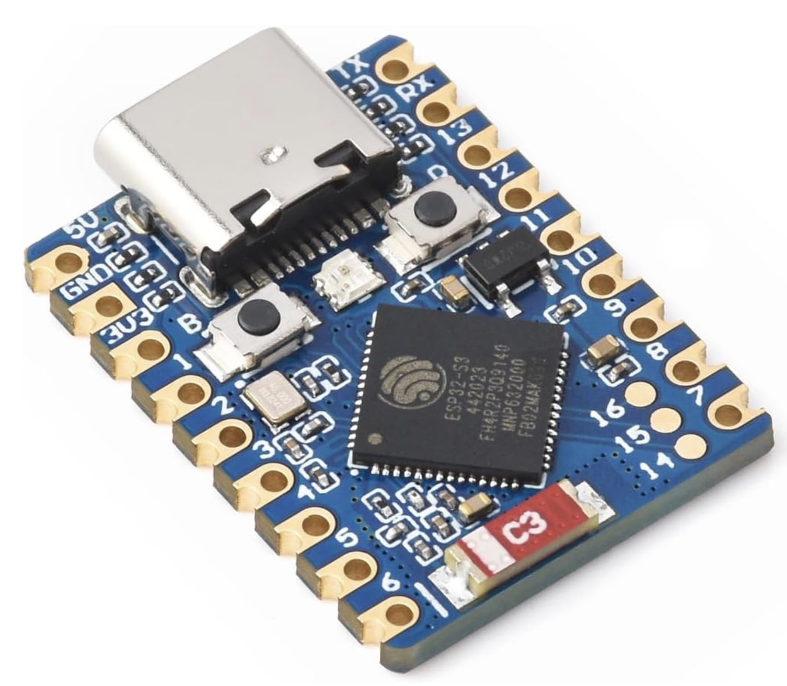
    </td>
    <td align="center" width="33%">
      <strong>GNSS-Empfänger</strong><br>
      Waveshare LG290P<br>mit Quectel LG290P<br><br>
      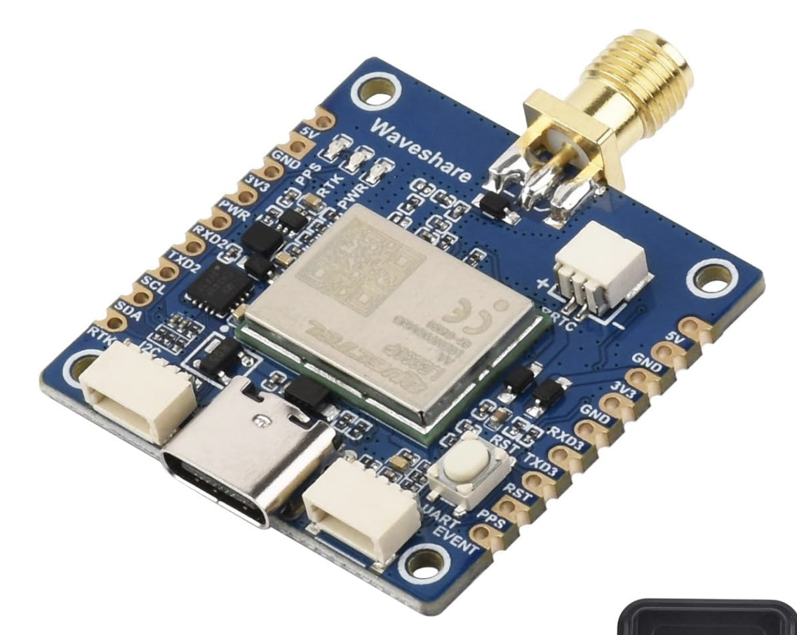
    </td>
    <td align="center" width="33%">
      <strong>GNSS-Antenne</strong><br>
      GPS L1/L2/L5 · BeiDou B1C/B2a/B3<br>
      GLONASS G1/G2/G3 · Galileo E1/E5/E6<br>
      QZSS · SBAS<br><br>
      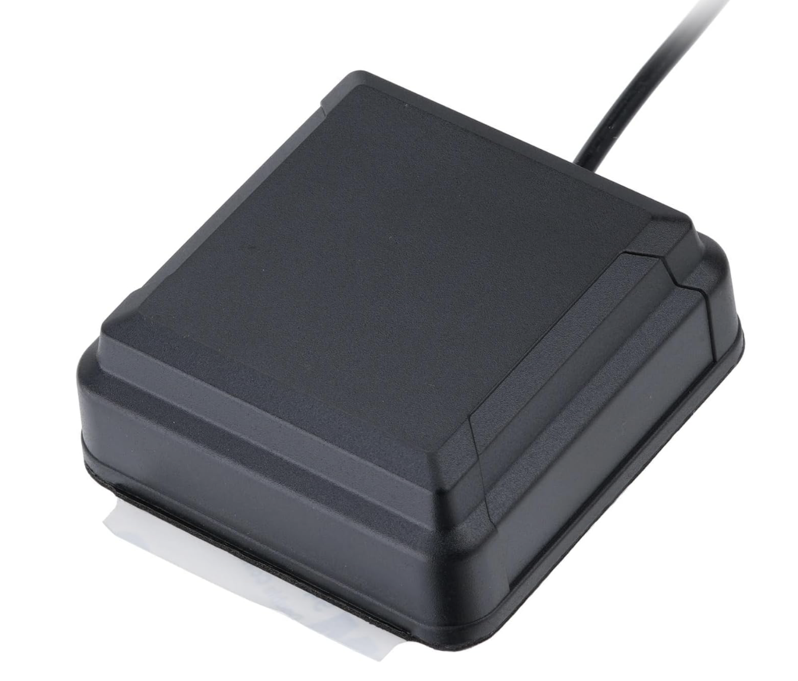
    </td>
  </tr>
  <tr>
    <td align="center" width="33%">
      <strong>Neigungssensor</strong><br>
      GY-521 mit MPU-6050<br><br>
      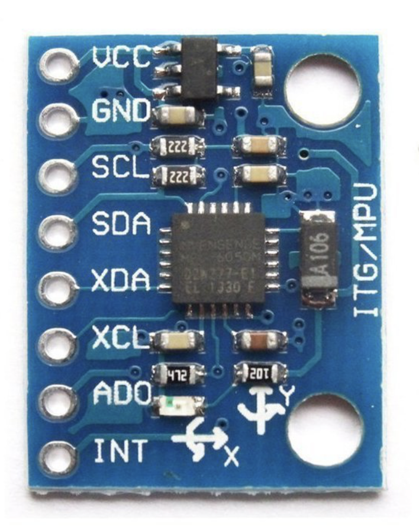
    </td>
    <td align="center" width="33%">
      <strong>Einhandstativ</strong><br>
      1/4-Zoll-Standard-Fotogewinde<br>mit Schraubplatte<br><br>
      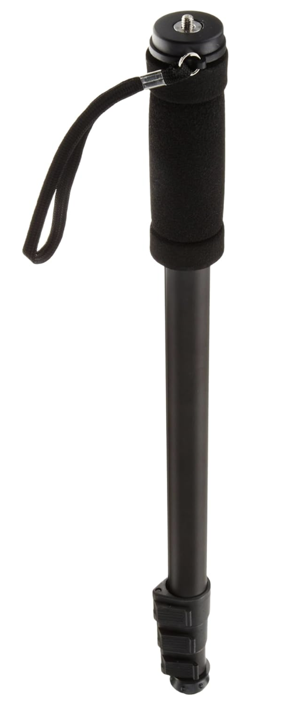
      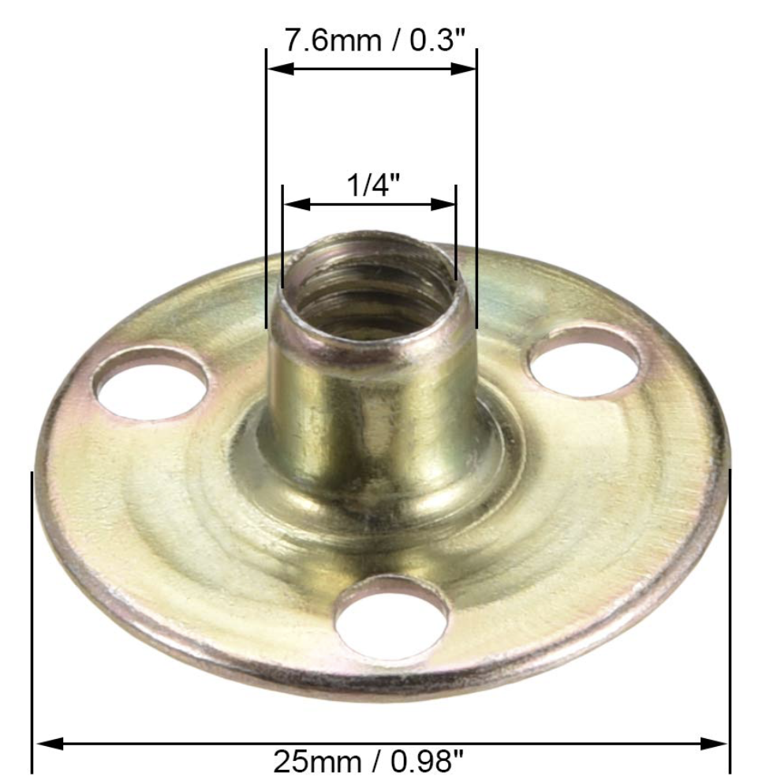
    </td>
    <td align="center" width="33%">
      <strong>Stahl-/Edelstahlronde</strong><br>
      1 mm Stärke<br>
      120 mm Durchmesser<br><br>
      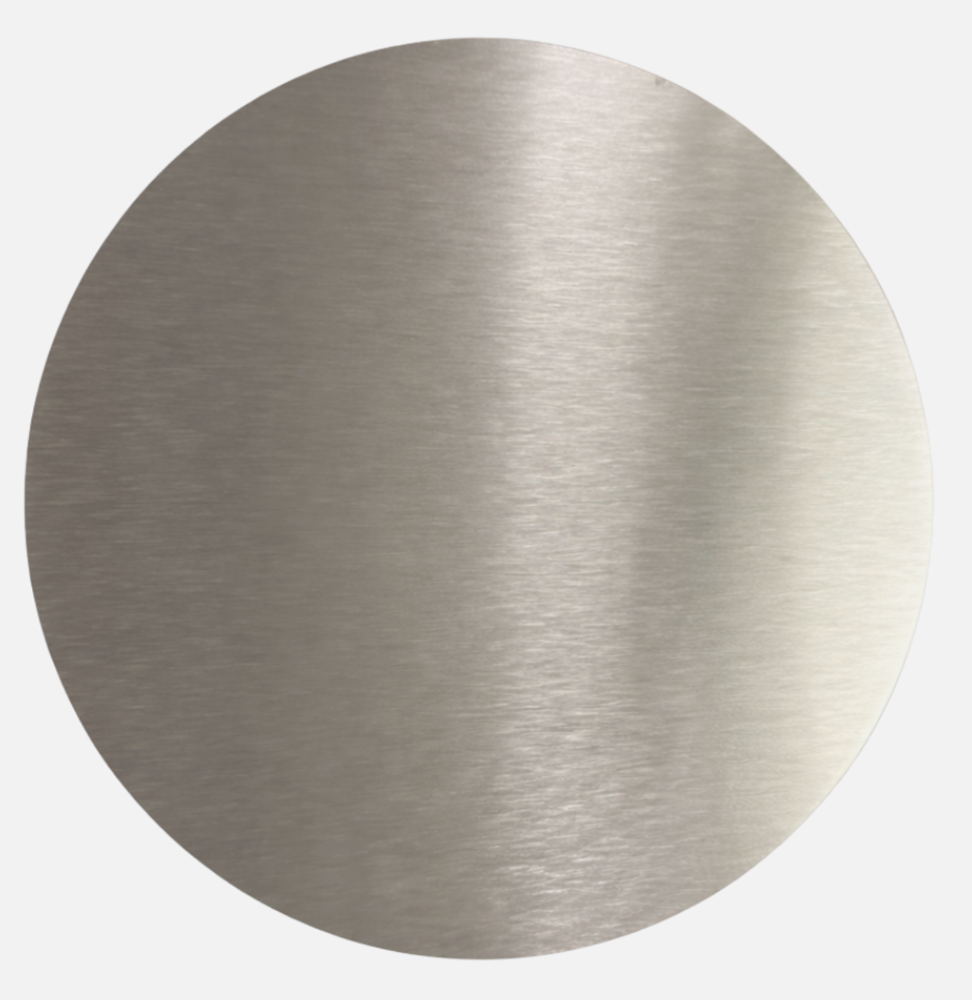
    </td>
  </tr>
</table>

Die Druckdatei für das Gehäuse liegt unter
[`case/case.3mf`](case/case.3mf).

## Hardware anschließen

### GY-521 mit ESP32-S3 verbinden

| GY-521 | ESP32-S3-Zero | Funktion |
|---|---|---|
| `VCC` | `3V3` | Versorgung mit 3,3 V |
| `GND` | `GND` | Gemeinsame Masse |
| `SDA` | `GPIO 8` | I²C-Daten |
| `SCL` | `GPIO 9` | I²C-Takt |

Die Firmware erkennt den MPU-6050 an `0x68` oder `0x69`. Wird kein Sensor
gefunden, aktiviert sie automatisch den integrierten IMU-Simulator.

### LG290P mit ESP32-S3 verbinden

| LG290P | ESP32-S3-Zero | Funktion |
|---|---|---|
| `TX` | `GPIO 7` (`RX`) | NMEA-/PQTM-Daten vom LG290P |
| `RX` | `GPIO 10` (`TX`) | RTCM-Korrekturdaten zum LG290P |
| `GND` | `GND` | Gemeinsame Masse |

Die UART-Verbindung verwendet `460800 Baud`, `8N1`.

## Repository installieren

```sh
git clone https://github.com/netmb/KRover.git
cd KRover
```

## ESP32-Firmware installieren

### Voraussetzungen

- [PlatformIO Core](https://docs.platformio.org/en/latest/core/installation/index.html)
  oder Visual Studio Code mit der PlatformIO-Erweiterung
- Waveshare ESP32-S3-Zero und ein USB-Datenkabel
- angeschlossene Rover-Hardware gemäß den Tabellen oben

### Firmware bauen und übertragen

1. ESP32-S3-Zero per USB mit dem Mac oder PC verbinden.
2. In das Firmware-Verzeichnis wechseln.
3. Firmware bauen und auf das Board übertragen.
4. Den seriellen Monitor öffnen und den Start kontrollieren.

```sh
cd firmware
pio run -e waveshare-esp32-s3-zero
pio run -e waveshare-esp32-s3-zero -t upload
pio device monitor --baud 115200
```

Falls PlatformIO den Upload-Port nicht automatisch erkennt, kann er explizit
angegeben werden:

```sh
pio run -e waveshare-esp32-s3-zero -t upload \
  --upload-port /dev/cu.usbmodemXXXX
```

Nach erfolgreichem Start erscheint der Rover als BLE-Gerät `KRover-XXXX`. Die
letzten vier Zeichen werden aus der MAC-Adresse des ESP32 gebildet. Die aktuelle
Konfiguration in [`firmware/platformio.ini`](firmware/platformio.ini) verwendet
den echten LG290P (`KATASTER_GNSS_SIMULATION=0`).

### Firmware testen

```sh
cd firmware
pio test -e native
pio run -e waveshare-esp32-s3-zero
```

## iOS-App installieren

### Voraussetzungen

- macOS mit Xcode 26 oder neuer
- [XcodeGen](https://github.com/yonaskolb/XcodeGen)
- iPhone oder iPad mit iOS 17 oder neuer
- Apple-Development-Team für die Installation auf einem echten Gerät

XcodeGen kann beispielsweise mit Homebrew installiert werden:

```sh
brew install xcodegen
```

### Xcode-Projekt erzeugen

Das Xcode-Projekt wird aus [`ios/project.yml`](ios/project.yml) generiert und
nicht im Repository gespeichert:

```sh
cd ios
xcodegen generate
open KRover.xcodeproj
```

### App auf iPhone oder iPad installieren

1. In Xcode das Projekt `KRover` und das Target `KRover` auswählen.
2. Unter **Signing & Capabilities** das eigene Development-Team eintragen.
3. Das angeschlossene iPhone oder iPad als Zielgerät auswählen.
4. Das Scheme `KRover` starten (`⌘R`).
5. Auf dem Gerät den Zugriff auf Bluetooth und den Standort erlauben.
6. In der App den Rover `KRover-XXXX` auswählen und verbinden.
7. SAPOS-Zugangsdaten in der App hinterlegen und die NTRIP-Verbindung starten.

SAPOS-Zugangsdaten werden im iOS-Schlüsselbund gespeichert. Ein physisches
iPhone oder iPad ist für die BLE-Verbindung erforderlich; der iOS-Simulator
kann für UI-Entwicklung und Tests verwendet werden.

Falls die Bundle-ID mit dem eigenen Development-Team kollidiert, muss
`PRODUCT_BUNDLE_IDENTIFIER` in [`ios/project.yml`](ios/project.yml) angepasst
und das Projekt anschließend erneut mit `xcodegen generate` erzeugt werden.

### iOS-Tests ausführen

```sh
cd ios
xcodegen generate
xcodebuild -project KRover.xcodeproj \
  -scheme KRover \
  -destination 'platform=iOS Simulator,name=iPhone 17 Pro' \
  test
```

Die Tests mit dem live NRW-Katasterdienst werden ohne fest eingechecktes
Flurstück übersprungen. Für einen lokalen Integrationstest kann ein eigenes
Test-Flurstück ausschließlich für den Prozess gesetzt werden:

```sh
KROVER_INTEGRATION_PARCEL_ID='...' xcodebuild -project KRover.xcodeproj \
  -scheme KRover \
  -destination 'platform=iOS Simulator,name=iPhone 17 Pro' \
  test
```

Das BLE-Datenformat und die verwendeten Characteristics sind in
[`docs/ble-protocol.md`](docs/ble-protocol.md) dokumentiert.

## Lizenz

KRover ist unter der
[PolyForm Noncommercial License 1.0.0](LICENSE) verfügbar. Private und andere
nichtkommerzielle Nutzung ist im Rahmen dieser Lizenz erlaubt. Kommerzielle
oder gewerbliche Nutzung erfordert vorab eine separate schriftliche Lizenz von
[`netmb`](https://github.com/netmb).

Das Projekt ist damit öffentlich einsehbar (source available), aber keine Open-
Source-Software im Sinne der OSI-Definition.

Abhängigkeiten und sonstiges Material Dritter sind davon ausgenommen und
behalten ihre jeweiligen Lizenzen. Details stehen in den
[Drittanbieter-Hinweisen](THIRD_PARTY_NOTICES.md). Bei der Weitergabe
kompilierter App- oder Firmware-Binaries müssen zusätzlich die dort genannten
Lizenzbedingungen erfüllt werden.
